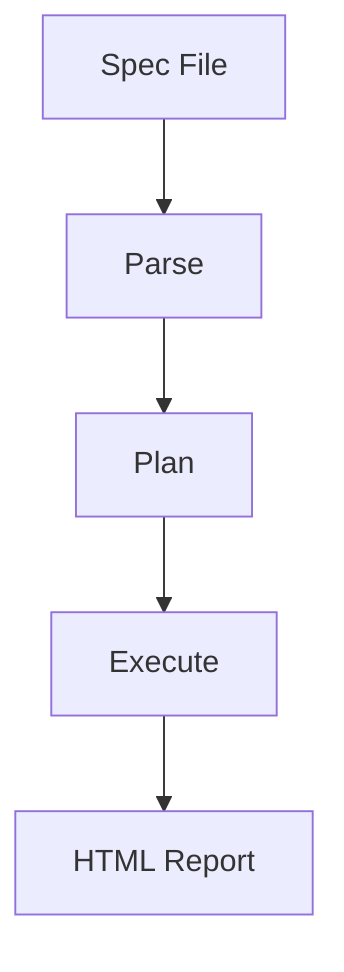
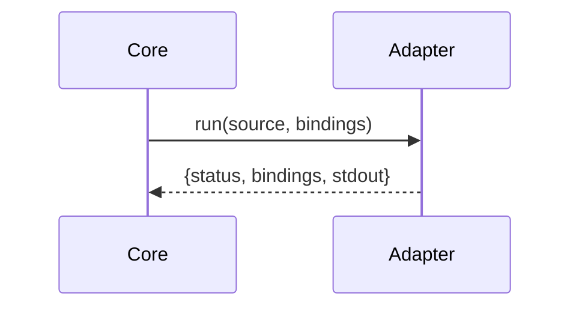

# HTML Report

The HTML report is a core deliverable — the document you are reading right now
is generated by this system.
The goal is to show an "executed specification," not a "test log."

After [running specs](cli.spec.md), specdown generates a multi-page HTML site.
Output path and format are set in the [depends::project config](config.spec.md).
Each spec file becomes a separate HTML page, with shared CSS and JS assets.
Prose is preserved as-is; only execution results are annotated with status.

This page itself is an example of the report. Here is what to look for:

- **Sidebar** (left) — lists every spec page with colored status dots. Documents in subdirectories are grouped; groups are collapsible and show aggregated status. See [TOC Grouping](config.spec.md#toc-grouping) for configuration. When a document has a frontmatter `type`, a colored badge appears next to its title
- **Header bar** — shows aggregate pass/fail/xfail counts as colored pills
- **Section headings** — carry a colored left border: green for pass, red for fail
- **Executable blocks** — a green left border means the block passed; red means it failed. Blocks with a summary line render collapsed and can be expanded with the `>` marker
- **Check tables** — each row shows pass/fail individually; failed rows display expected/actual diff inline
- **Alloy badges** — Alloy check results appear as small status badges next to the relevant section
- **Mermaid diagrams** — fenced blocks with `mermaid` info string render as interactive diagrams
- **Footer** — links to the project repository

## Multi-page Structure

Each document becomes a separate HTML page. Shared assets (style.css, script.js)
are written to the output root directory.

```run:shell
# Generate a minimal report for structure verification
mkdir -p .tmp-test
cat <<'SPEC' > .tmp-test/report-test.spec.md
# Report Test

A minimal spec for testing report generation.
SPEC
printf '# Report Test\n\n- [Report](report-test.spec.md)\n' > .tmp-test/index.spec.md
cat <<'CFG' > .tmp-test/report-test.json
{"entry":"index.spec.md","adapters":[]}
CFG
specdown run -config .tmp-test/report-test.json -out report-out 2>&1 || true
```

```run:shell
$ test -f .tmp-test/report-out/style.css && echo yes
yes
$ test -f .tmp-test/report-out/report-test.html && echo yes
yes
```

The report must be readable without JavaScript — all headings and content
render in plain HTML.

### Summary Lines

Blocks whose first line is a comment render collapsed in the report.
The summary text and pass/fail indicator are visible; a `>` marker
lets readers expand the block. Failed blocks auto-expand.

### Link Rewriting

Markdown links to `.md` and `.spec.md` files are rewritten to `.html` in the output.

## Output Files

| File                                    | Description                                       |
| --------------------------------------- | ------------------------------------------------- |
| `<outDir>/style.css`                    | Shared stylesheet                                 |
| `<outDir>/script.js`                    | Shared JavaScript                                 |
| `<outDir>/<page>.html`                  | Per-document HTML pages                           |
| `<outDir>/report.json`                  | Machine-readable results                          |
| `.artifacts/specdown/models/*.als`      | Combined Alloy models                             |
| `.artifacts/specdown/counterexamples/*` | Counterexample artifacts (on Alloy check failure) |

When trace is configured, each spec page gains a sticky **Traceability** panel
on the right side showing the document's parents (incoming edges), the current
document highlighted, and its children (outgoing edges) with relationship labels.

## Mermaid Diagrams

Fenced code blocks with `mermaid` as the info string are rendered as
interactive diagrams in the HTML report. These blocks are non-executable
— they carry no test case and are not sent to any adapter.

The Mermaid library is loaded from a CDN via progressive enhancement:

- If the page contains no `<pre class="mermaid">` elements, no script is loaded
- On load failure (e.g. offline), the raw diagram source remains visible as a styled code block
- The library version is pinned with an SRI integrity hash

Here is a live example — this block renders as a diagram in the report
and as plain source when viewed as Markdown:



Flowcharts, sequence diagrams, and other Mermaid diagram types are all
supported — any valid Mermaid syntax works:



The diagram source is HTML-escaped before embedding, preventing XSS
through crafted diagram content.

## Failure Diagnostics

When an adapter returns `expected`/`actual` values on failure,
those values appear in both the CLI output and the JSON report.

The CLI output format for check table failures includes the row number
and optional label:

```
  FAIL  Heading > Path  [check-name] row 5 "description"
        error message
        expected: expected-value
        actual:   actual-value
```

The HTML report renders expected/actual as an inline diff.
The JSON report includes a `schemaVersion` field (currently `2`).
Common fields (`expected`, `actual`, `label`) remain at the top level
of each case result. Kind-specific fields are nested under `code`,
`table`, or `alloy` keys.
